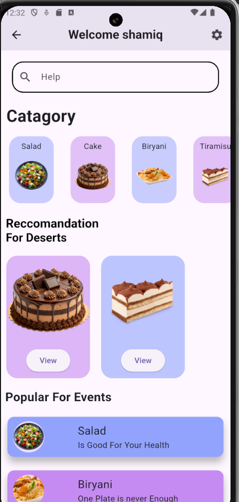
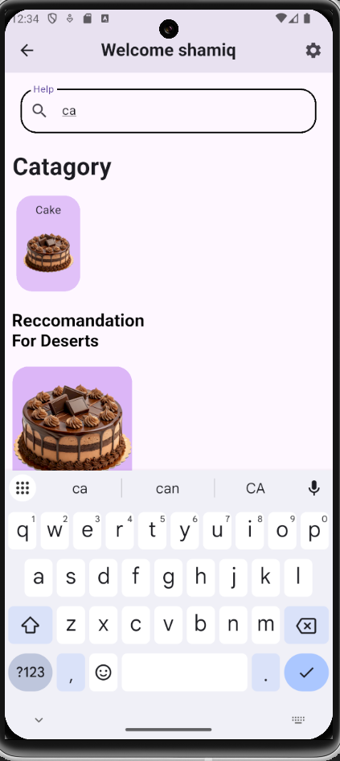
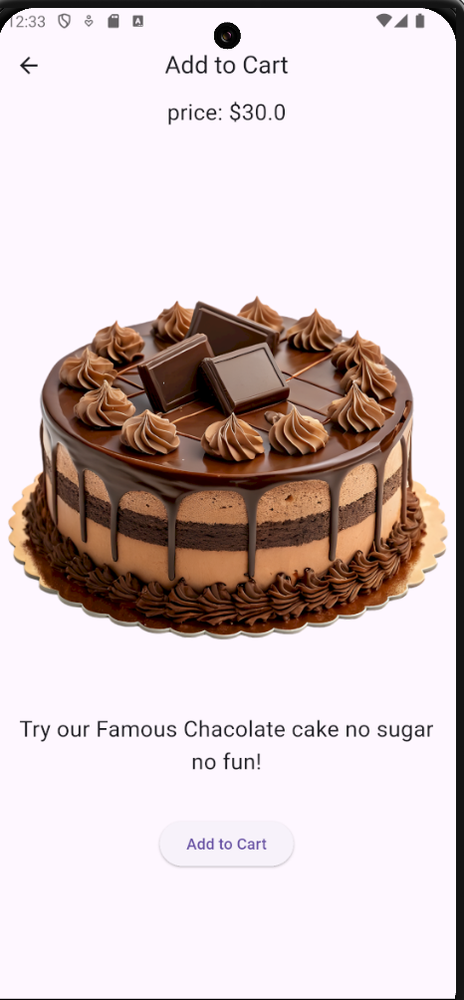
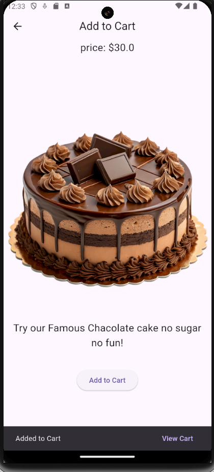
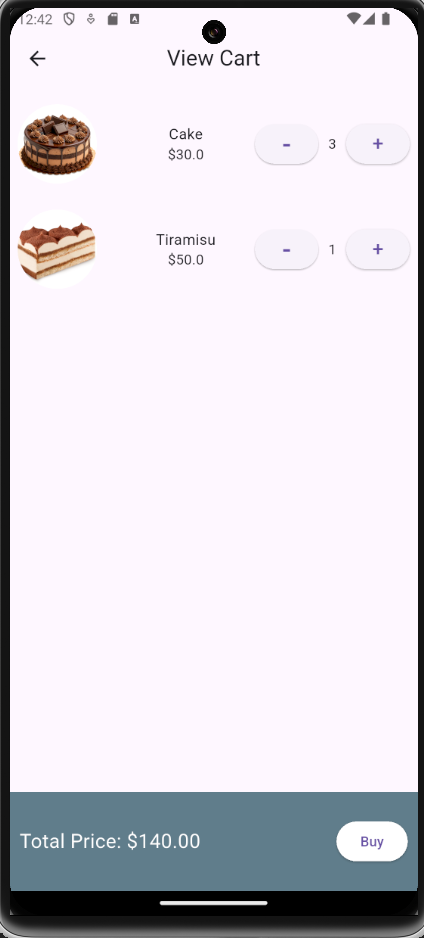

# 🍰 Bakery App

A modern Flutter-based bakery shopping application that allows users to browse products, search for items, view detailed product information, and manage their cart seamlessly. The app focuses on providing a clean, responsive, and user-friendly shopping experience while demonstrating key Flutter development concepts.

---

## ✨ Features

* User Login Authentication
* Beautiful and Responsive Flutter UI
* Product Listing with Images and Details
* Food Category Browsing
* Real-Time Product Search and Filtering
* Detailed Product View Page
* Add Products to Cart
* Fully Functional Shopping Cart
* Dynamic Quantity Management
* Automatic Price Updates Based on Quantity
* Smooth Navigation Between Screens

---

## 📱 App Screens

### 🏠 Home Screen

The Home Screen serves as the main entry point of the application. Users can browse bakery products, view recommendations, search for specific items, and quickly add products to their cart. The search functionality filters products in real time, providing a smooth shopping experience. The entire page is fully responsive and adapts to different screen sizes.

  
  

---

### 🍩 Product Details Screen

When a user selects a product from the Home Screen, they are taken to the Product Details page. This screen displays an enlarged product image, detailed description, pricing information, and all relevant product details. Users can review the product and add it directly to their cart from this page.

  
  

---

### 🛒 Cart Screen

The Cart Screen displays all products that have been added to the cart. Users can increase or decrease product quantities, and the total price updates automatically based on the selected quantity. This page provides a complete overview of the order before purchase and includes a Buy button to proceed with checkout.

  

---

## 🛠️ Tech Stack

* Flutter
* Dart
* Material Design

---

## 🎯 Key Concepts Demonstrated

* Flutter UI Development
* Responsive Design
* Navigation & Routing
* Search & Filtering Logic
* Dynamic Cart Functionality
* Quantity and Price Calculations
* Asset Management
* Reusable Widgets
